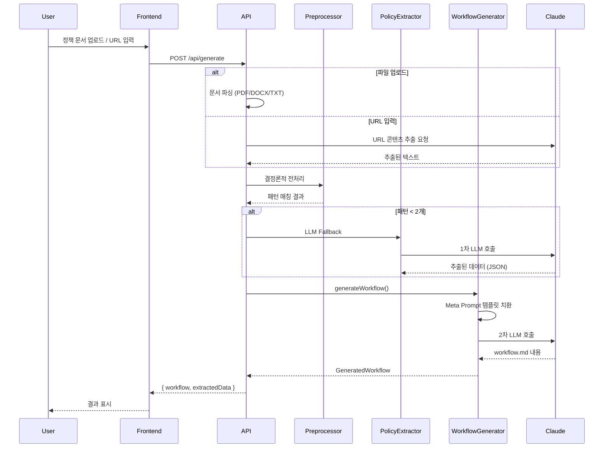

# Workflow Generator Web

정책 문서를 업로드하면 AI(Claude)가 분석하여 MCP 기반 AI Agent용 검증 워크플로우(workflow.md)를 자동 생성하는 웹 애플리케이션입니다.

---

## 요약 (TL;DR)

> **정책 문서 → 전처리/AI 분석 → workflow.md 생성**

1. 정책 문서 업로드 (PDF, DOCX, TXT) 또는 **URL 입력**
2. **결정론적 전처리기**: 패턴 매칭으로 정책 데이터 추출 (LLM 없이)
3. 전처리 실패 시 **LLM Fallback**: Claude가 정책 데이터 추출
4. 2차 LLM: 추출된 데이터를 meta-prompt에 주입하여 workflow.md 생성
5. 생성된 워크플로우 복사/다운로드

---

## 기술 스펙

| 구분 | 기술 |
|------|------|
| **Framework** | Next.js 15.3.5 (App Router) |
| **Runtime** | React 19, TypeScript 5 (Strict Mode) |
| **Styling** | TailwindCSS 3.4 |
| **UI Components** | Radix UI, Lucide Icons |
| **LLM** | Claude Sonnet 4 (`Claude Opus 4.5`) |
| **LLM SDK** | @anthropic-ai/sdk v0.32.0 |
| **Document Parsing** | pdf-parse (PDF), mammoth (DOCX) |
| **Validation** | Zod |

---

## 주요 기능

### 1. 다중 입력 소스 지원
- **파일 업로드**: PDF, DOCX, TXT, Markdown (최대 10MB)
- **URL 입력**: 웹 페이지에서 정책 내용 추출
- 드래그 앤 드롭 / 클릭 업로드 / 탭 전환 UI

### 2. 하이브리드 추출 시스템
```
[정책 문서]
    ↓ 결정론적 전처리기 (preprocessor.js)
    ↓ 패턴 매칭 결과 < 2개?
    │   ├── Yes → LLM Fallback (Claude 추출)
    │   └── No  → 전처리 결과 사용
    ↓
[추출된 데이터: 역할, 위험등급, 체크리스트, 패턴 매칭 결과]
    ↓ Meta Prompt 템플릿 치환
    ↓ 2차 LLM (Workflow Generator)
[workflow.md 생성]
```

### 3. 프롬프트 편집기
- System Prompt / Meta Prompt 실시간 편집 (세션 내)
- 확대/축소 토글 기능
- 파일 기반 프롬프트 로드 (`/prompt/*.md`)

### 4. 워크플로우 출력
- Markdown 미리보기
- 클립보드 복사
- 토큰 사용량 표시

---

## 핵심 모듈

### `/app` - Next.js App Router
| 파일 | 설명 |
|------|------|
| `page.tsx` | 메인 페이지 (3-컬럼 레이아웃) |
| `api/generate/route.ts` | 워크플로우 생성 API (파일/URL 처리 → 전처리 → LLM) |
| `api/prompts/route.ts` | 프롬프트 조회 API (GET only) |

### `/lib/llm` - LLM 통합
| 파일 | 설명 |
|------|------|
| `claude-client.ts` | Anthropic SDK 래퍼, 토큰 로깅 |
| `policy-extractor.ts` | 전처리기 우선 + LLM Fallback 로직 |
| `workflow-generator.ts` | 2차 LLM: 워크플로우 생성, 템플릿 치환 |
| `url-content-fetcher.ts` | URL에서 정책 내용 추출 (fetch + Claude) |

### `/lib/parsers` - 문서 파서
| 파일 | 설명 |
|------|------|
| `pdf-parser.ts` | PDF 텍스트 추출 (pdf-parse) |
| `docx-parser.ts` | DOCX 텍스트 추출 (mammoth) |
| `text-parser.ts` | TXT/Markdown 처리 |

### `/components` - UI 컴포넌트
| 컴포넌트 | 설명 |
|----------|------|
| `file-upload/` | 파일/URL 입력 UI + 상태 관리 훅 |
| `prompt-editor/` | 프롬프트 편집기 (읽기 전용 저장) |
| `extracted-data/` | 추출된 정책 데이터 표시 |
| `workflow-output/` | 생성된 워크플로우 출력 |

### `/prompt` - 프롬프트 및 전처리기
| 파일 | 설명 |
|------|------|
| `policy-prompt/system-prompt.md` | Omni Verification Agent 시스템 정의 |
| `policy-prompt/meta-prompt.md` | workflow.md 생성용 메타 프롬프트 (v3.0) |
| `preprocessor.js` | 결정론적 패턴 매칭 전처리기 |
| `pattern-registry.json` | 패턴 매칭 규칙 정의 |

### `/types` - TypeScript 타입
| 파일 | 설명 |
|------|------|
| `workflow.ts` | GeneratedWorkflow, ExtractedPolicyData, PreprocessorOutput |
| `api.ts` | API 요청/응답 타입, InputSource, URL_CONSTRAINTS |
| `prompts.ts` | PromptType, PromptContent |

---

## 설치 및 실행

### 필수 요구사항
- **Node.js**: 18.17.0 이상
- **npm** 또는 **pnpm**
- **Anthropic API Key**: Claude 사용

### 의존성 설치
```bash
npm install
# 또는
pnpm install
```

### 환경 변수 설정
```bash
cp .env.local.example .env.local

# .env.local 파일에 API 키 설정
ANTHROPIC_API_KEY=sk-ant-api03-your-key-here
```

### 개발 서버 실행
```bash
npm run dev
```
→ http://localhost:3500 에서 접속

### 프로덕션 빌드
```bash
npm run build
npm run start
```

### 코드 검증
```bash
npm run typecheck  # TypeScript 타입 체크
npm run lint       # ESLint 검사
```

---

## 아키텍처

### 프로젝트 구조
```
omni-prompting-test/
├── app/                    # Next.js App Router
│   ├── api/
│   │   ├── generate/       # 워크플로우 생성 API
│   │   └── prompts/        # 프롬프트 조회 API
│   ├── page.tsx            # 메인 페이지
│   └── layout.tsx          # 루트 레이아웃
├── components/             # React 컴포넌트
│   ├── file-upload/        # 파일/URL 업로드
│   ├── prompt-editor/      # 프롬프트 편집기
│   ├── extracted-data/     # 추출 데이터 표시
│   ├── workflow-output/    # 워크플로우 출력
│   └── ui/                 # 공통 UI 컴포넌트
├── lib/
│   ├── llm/                # LLM 클라이언트 및 추출기
│   ├── parsers/            # 문서 파서
│   ├── api/                # API 유틸리티
│   └── utils/              # 공통 유틸리티
├── prompt/                 # 프롬프트 + 전처리기
│   ├── policy-prompt/
│   │   ├── system-prompt.md
│   │   └── meta-prompt.md
│   ├── preprocessor.js     # 결정론적 전처리기
│   └── pattern-registry.json
├── types/                  # TypeScript 타입 정의
└── specs/                  # 스펙 문서
```

### 워크플로우 생성 플로우


---

## API 엔드포인트

| Method | Endpoint | 설명 |
|--------|----------|------|
| POST | `/api/generate` | 워크플로우 생성 (multipart/form-data) |
| GET | `/api/prompts?type=system\|meta` | 프롬프트 조회 |

### POST /api/generate

**요청 (FormData)**:
- `policyDocument`: 파일 (PDF, DOCX, TXT, MD)
- `documentUrl`: URL 문자열 (파일 대신 사용 가능)
- `systemPrompt`: 시스템 프롬프트 오버라이드 (선택)
- `metaPrompt`: 메타 프롬프트 오버라이드 (선택)

**응답**:
```json
{
  "success": true,
  "workflow": {
    "content": "# workflow.md 내용...",
    "generatedAt": "2025-01-01T00:00:00Z",
    "sourceDocument": "policy.pdf",
    "tokenUsage": { "inputTokens": 1000, "outputTokens": 2000, "totalTokens": 3000 }
  },
  "extractedData": {
    "summary": "정책 요약",
    "verificationRules": ["규칙1", "규칙2"],
    "content": "상세 내용",
    "extractionMethod": "preprocessor",
    "preprocessorOutput": { ... }
  }
}
```

---

## 에러 코드

| 코드 | 설명 |
|------|------|
| `INVALID_FILE_TYPE` | 지원하지 않는 파일 형식 |
| `FILE_TOO_LARGE` | 파일 크기 초과 (10MB) |
| `PARSE_ERROR` | 문서 파싱 실패 |
| `NO_INPUT` | 파일 또는 URL이 없음 |
| `INVALID_URL` | 잘못된 URL 형식 |
| `URL_FETCH_FAILED` | URL 콘텐츠 추출 실패 |
| `URL_TIMEOUT` | URL 요청 시간 초과 |
| `LLM_ERROR` | LLM API 호출 실패 |
| `RATE_LIMITED` | API 요청 제한 |
| `TIMEOUT` | 요청 시간 초과 |

---

## 라이선스

Private - All rights reserved
